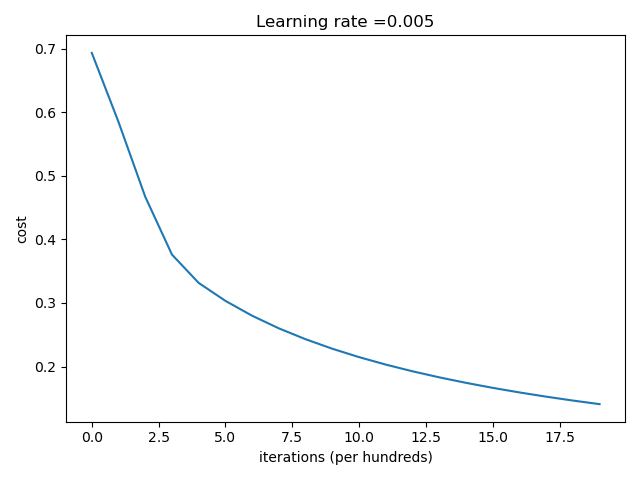
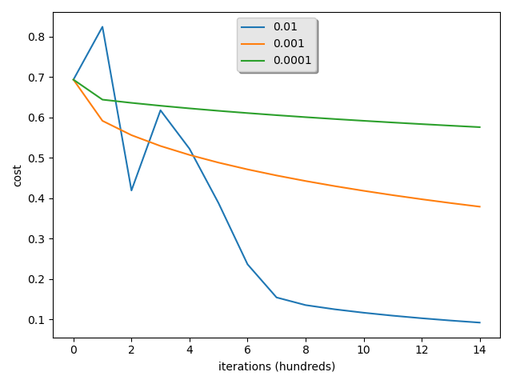

Cat Classifier with LogIt Regression from Andrew NG's Coursera 

## Accuracy Stats
2000 iterations with learning rate 0.005  
Train: 0.99  
Test:  0.7  

## Training Learning Curve:
  

## Learning Curves per Learning Rate:
  
